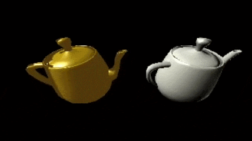

# Rust Software Graphics Engine

> A fully custom 3D rendering framework written in Rust, implementing a modern graphics pipeline from scratch without relying on OpenGL, Vulkan, DirectX, or any GPU APIs. All geometry processing, rasterisation, interpolation, and shading are implemented from scratch in Rust.

> The project explores the fundamentals of real-time rendering by building the core systems behind a traditional GPU pipeline, including vertex processing, clipping, rasterisation, interpolation, lighting, materials, and SIMD-accelerated rendering.


## Example

The same Utah teapot rendered using two independent shader pipelines within a single render pass.

The left model uses Phong shading (lighting calculated per fragment), while the right model uses Gouraud shading (lighting calculated per vertex). Both share the same renderer, scene, and geometry; only the pipeline changes.

<p align="center">
    
</p>

Rendering with multiple pipelines requires only a few API calls:

```rust
let mut render_pass = renderer.begin_render_pass(&mut render_target, RenderPassDescriptor {
    viewport: Viewport::full(&extent),
    load: LoadOp::Clear(Colour::BLACK),
    store: StoreOp::Store,
});

for draw_call in gouraud_teapot.draw_calls(|_| GouraudFragmentUniforms) {
    render_pass.draw(&gouraud_pipeline, draw_call, gouraud_vertex_uniforms.clone());
}

for draw_call in phong_teapot.draw_calls(|mesh| PhongFragmentUniforms {
    scene: scene_uniforms.clone(),
    material: phong_teapot
        .materials
        .get(mesh.material_index.unwrap())
        .cloned(),
}) {
    render_pass.draw(&phong_pipeline, draw_call, phong_vertex_uniforms.clone());
}

render_pass.finish();
```

The complete example, including the shader implementations, camera setup, lighting, and model loading, can be found in [`engine/examples/pipelines.rs`](./engine/examples/pipelines.rs).

---

## Multipass Rendering

Render passes write to explicit `RenderTarget`s rather than directly to the screen, and a completed target can be sampled as a texture in a later pass. This makes it possible to build a scene up across multiple passes, then post-process the result:

```rust
// Pass 1: render the scene into an offscreen target.
let mut pass = context.begin_render_pass(&mut scene_target, RenderPassDescriptor {
    viewport: Viewport::full(&extent),
    colour_load_op: LoadOp::Clear(Colour::BLACK),
    depth_load_op: Some(LoadOp::Clear(1.0)),
});
model.draw_to_render_pass(&mut pass, &model_pipeline, vertex_uniforms, fragment_uniforms);
pass.finish();

// Convert the finished target into a sampleable texture.
let scene_texture = Arc::new(render_target_sampler(&scene_target));

// Pass 2: post-process into the presentation target (e.g. chromatic aberration, vignette,
// greyscale, invert, Gaussian blur, Sobel edge detection).
let mut pass = context.begin_presentation_pass(RenderPassDescriptor {
    viewport: Viewport::full(&extent),
    colour_load_op: LoadOp::Clear(Colour::BLACK),
    depth_load_op: None,
});
fullscreen_quad.draw_to_render_pass(&mut pass, &postprocess_pipeline, vertex_uniforms, |_| FragmentUniforms {
    source: scene_texture.clone(),
    // ...
});
pass.finish()
```

`LoadOp::Load` also allows a render pass to accumulate onto an existing target's contents instead of clearing it, so a background pass and a foreground pass can share the same target without either overwriting the other. See [`engine/examples/render_passes.rs`](./engine/examples/render_passes.rs) for the full offscreen-target-to-post-process pipeline, and [`cpu_rasteriser/examples/render_passes.rs`](./cpu_rasteriser/examples/render_passes.rs) for the same idea at the low-level renderer API.

---

## SIMD Rendering

SIMD rendering is exposed through `SimdPipeline` and `RenderPass::draw_simd`. SIMD-capable shaders process multiple fragments at once using the SIMD varying representation.

```rust
let pipeline = SimdPipeline::new(
    vertex_shader,
    fragment_shader,
)
.with_depth_state(DepthState::DEFAULT);

render_pass.draw_simd(
    &pipeline,
    draw_call,
    vertex_uniforms,
);
```

A shader used with `SimdPipeline` implements `FragmentShaderSimd`. SIMD support is independent of the scalar `FragmentShader` trait, so shaders can provide whichever rendering paths they require.

The full SIMD rendering example can be found in the engine examples. See [`engine/examples/bloom.rs`](./engine/examples/bloom.rs)

---

## Architecture

The project is organised as two independent crates:

```
software-graphics/
├── cpu_rasteriser/     # Low-level CPU rendering API
├── rasteriser_macros/  # Procedural macros
└── engine/             # High-level scene and asset management
```

The `cpu_rasteriser` crate provides a reusable software implementation of a modern graphics pipeline, exposing concepts such as pipelines, shaders, draw calls, render passes, and render targets.

The `rasteriser_macros` crate provides derive macros including `#[derive(Interpolate)]` and `#[derive(SimdInterpolate)]`. These generate scalar and SIMD interpolation implementations for user-defined vertex/varying structs, reducing the amount of shader and rasterisation boilerplate.

The `engine` crate builds on top of the renderer, providing higher-level abstractions including cameras, models, materials, lights, scene management, and asset loading.

This separation mirrors the design of modern graphics ecosystems, where rendering APIs remain independent of engine-level concepts.

---

## Features

### Complete Rendering Pipeline

Implemented a full CPU-based rendering pipeline:

```
Vertex Buffers
    ↓
Render Pass
    ↓
Pipeline Selection
    ↓
Draw Calls
    ↓
Vertex Processing
    ↓
Clipping
    ↓
Primitive Assembly
    ↓
Tile Binning
    ↓
Parallel Rasterisation
    ↓
Fragment Shading (Depth Test → Shade → Blend → Depth Write)
    ↓
Render Target (Framebuffer + optional Depth Buffer)
```

Supported features:

- Model, view, and projection transformations
- Perspective and orthographic cameras
- Homogeneous coordinate clipping
- Near-plane and frustum clipping
- Backface culling
- Depth buffering with configurable test/write behaviour
- Indexed mesh rendering
- Programmable vertex and fragment shaders
- Explicit render targets and render passes with configurable load/store operations
- Multipass rendering: chaining passes, both onto the same target and into offscreen targets sampled as textures by later passes

---

## Rasterisation

The rasteriser includes custom implementations of:

- Triangle scanline rasterisation
- Bresenham line drawing
- Circle rasterisation
- Barycentric interpolation
- Perspective-correct interpolation

Perspective correction ensures attributes such as normals, colours, and depth values are correctly interpolated across projected triangles.

---

## Parallel Tile-Based Rendering

To improve rendering performance, the rasteriser uses a tile-based rendering pipeline executed across multiple CPU threads.

After vertex processing and clipping, triangles are converted into rasterisation commands and binned into fixed-size screen-space tiles. Each tile is then rasterised independently by a worker thread. Tiles are seeded from the render pass's load operations, so a `Load` pass correctly rasterises on top of a target's existing contents rather than a blank tile.

The tile system is independent of the active shader pipeline, allowing different vertex and fragment shader combinations to contribute rendering work to the same render pass.

Once all worker threads have completed, the tile framebuffers (and depth buffers) are merged back into the render target.

This approach provides:

- Parallel triangle rasterisation across CPU cores
- No locking during fragment processing
- Improved cache locality through tile-based rendering
- Memory-safe multithreading using Rust's ownership model

---

## Generic Shader Pipeline Architecture

The renderer uses a strongly typed, generic shader pipeline inspired by modern graphics APIs and projects such as [black](https://github.com/sinclairzx81/black).

Rather than hard-coding specific rendering techniques, the pipeline is parameterised over user-defined vertex and fragment shader implementations:

```rust
trait VertexShader {
    type Vertex;
    type Uniforms;
    type Varyings;

    fn shade(
        &self,
        vertex: Self::Vertex,
        uniforms: &Self::Uniforms,
    ) -> (Vec4, Self::Varyings);
}


trait FragmentShader<Varyings> {
    type Uniforms;

    fn shade(
        &self,
        varyings: Varyings,
        uniforms: &Self::Uniforms,
    ) -> Colour;
}

trait FragmentShaderSimd<Varyings>
where
    Varyings: SimdInterpolate
{
    type Uniforms;

    fn shade_simd(
        &self,
        varyings: Varyings::Simd,
        uniforms: &Self::Uniforms,
    ) -> ColourSimd;
}
```

Varying structs implement `Interpolate` for scalar interpolation and `SimdInterpolate` for SIMD interpolation. Both can be generated automatically using `#[derive(Interpolate, SimdInterpolate)]`.

The two pipeline types provide separate execution paths:

```rust
Pipeline<VertexShader, FragmentShader>
SimdPipeline<VertexShader, FragmentShaderSimd>
```

A scalar `Pipeline` uses scalar rasterisation and fragment shading, while a `SimdPipeline` processes fragments in SIMD batches. This allows SIMD-capable shaders to operate on multiple fragments simultaneously without requiring every shader to provide a scalar implementation.

This allows different rendering techniques to share the same underlying pipeline while maintaining compile-time type safety. The renderer does not need to know the details of a shader implementation, it only executes the generic pipeline stages and processes the resulting geometry and fragments.

---

## Pipeline and Render Pass Architecture

The renderer uses an explicit pipeline and render pass model inspired by modern graphics APIs such as Vulkan, Direct3D, and Metal.

Rendering is separated into:

- Render targets (colour + optional depth buffer)
- Pipeline state
- Render pass recording (with colour/depth load operations)
- Draw commands
- Rasterisation

The renderer provides two pipeline types:

```rust
Pipeline<VertexShader, FragmentShader>
SimdPipeline<VertexShader, FragmentShaderSimd>
```

`Pipeline` selects the scalar rendering path. `SimdPipeline` selects the SIMD rendering path and requires a SIMD-capable fragment shader.

Both pipelines contain:

- Vertex shader
- Fragment shader
- Culling mode
- Colour blending state (blend factors and operation)
- Depth test/write state

A render pass can contain both scalar and SIMD draw calls. Scalar pipelines are submitted with `RenderPass::draw`, while SIMD pipelines are submitted with `RenderPass::draw_simd`.

This keeps the public API explicit about the rendering path while allowing both types of work to share the same tile-based scheduling and render-pass infrastructure.

Multiple render passes can be chained together, allowing the renderer to support techniques such as:

- Multi-stage rendering
- Post-processing
- Render-to-texture workflows
- Layered rendering
- Intermediate render targets

This separates the lifetime of rendering commands from the lifetime of a frame. The renderer operates on explicit render targets and render passes rather than requiring all rendering to be recorded into a single frame object.

---

## Application Framework

The `engine` crate provides an `Application` trait and two interchangeable windowing backends: `WinitEngine` and `MinifbEngine`, behind a common `EngineBackend` trait. Implementing `update`, `render`, `resize`, and `event` is enough to get a running, resizable window with normalised keyboard/mouse input on either backend:

```rust
impl Application for MyApp {
    fn update(&mut self, dt: f32) { /* ... */ }
    fn render<'frame>(&mut self, context: &'frame mut RenderContext<'frame>) -> PresentedFrame { /* ... */ }
    fn resize(&mut self, width: u32, height: u32) { /* ... */ }
    fn event(&mut self, event: AppEvent, handle: &mut AppHandle) { /* ... */ }
}

MinifbEngine::new()
    .with_title("My App")
    .with_size(640, 360)
    .run(MyApp::new()?)
```

Built-in `OrbitControls` and `FirstPersonControls` camera controllers consume this normalised input to drive a `Camera` without any backend-specific code.

---

## Supported Features

### Rasteriser

| Feature                                          | Status |
| ------------------------------------------------ | ------ |
| 3D transformations                               | ✅     |
| Triangle rasterisation                           | ✅     |
| Line and circle rasterisation                    | ✅     |
| Depth buffering                                  | ✅     |
| Configurable depth test/write state              | ✅     |
| Backface culling                                 | ✅     |
| Frustum clipping                                 | ✅     |
| Perspective-correct interpolation                | ✅     |
| Tile-based rendering                             | ✅     |
| Multithreaded rasterisation                      | ✅     |
| Generic shader pipelines                         | ✅     |
| Pipeline state abstraction                       | ✅     |
| Explicit render targets                          | ✅     |
| Render passes with load/store operations         | ✅     |
| Multipass rendering (offscreen targets)          | ✅     |
| Multiple pipelines per render pass               | ✅     |
| Configurable colour blending (5 ops, 10 factors) | ✅     |
| `#[derive(Interpolate)]` macro                   | ✅     |
| SIMD rasterisation                               | ✅     |
| SIMD fragment shading                            | ✅     |
| SIMD depth testing and writing                   | ✅     |
| SIMD colour blending                             | ✅     |
| SIMD texture sampling                            | ✅     |
| `#[derive(SimdInterpolate)]` macro               | ✅     |

### Engine

| Feature                                                      | Status |
| ------------------------------------------------------------ | ------ |
| Perspective camera                                           | ✅     |
| Orthographic camera                                          | ✅     |
| Orbit and first-person camera controllers                    | ✅     |
| Indexed meshes                                               | ✅     |
| Multiple materials                                           | ✅     |
| Directional lighting                                         | ✅     |
| Gouraud shading                                              | ✅     |
| Phong shading                                                | ✅     |
| OBJ / MTL loading                                            | ✅     |
| Textures (bilinear/nearest filtering, repeat/clamp wrapping) | ✅     |
| Render-to-texture / offscreen render targets                 | ✅     |
| Post-processing pipeline                                     | ✅     |
| Application framework (winit + minifb backends)              | ✅     |
| Unified input handling across backends                       | ✅     |
| Window resizing                                              | ✅     |

---

## Technical Highlights

This project demonstrates experience with:

- Rust systems programming
- Graphics pipeline architecture
- Linear algebra and 3D mathematics
- CPU rasterisation algorithms
- Programmable shader design
- Tile-based rendering
- Concurrent rendering using thread pools
- Memory-safe multithreading with Rust
- Performance optimisation and cache-aware rendering
- Trait-based extensible rendering architecture
- Rendering API architecture inspired by modern graphics APIs
- Render-target and render-pass based rendering, including multipass and render-to-texture compositing
- Post-processing effects driven by fragment shaders sampling a previous pass's output
- Cross-backend windowing and input abstraction (winit / minifb)
- Procedural noise and ray-marched fractal fragment shaders
- Procedural macros for reducing shader boilerplate
- SIMD-accelerated CPU rasterisation and fragment shading
- SIMD depth testing, blending, and texture sampling
- Compile-time scalar and SIMD shader pipeline selection
- Procedural macros for generating SIMD interpolation implementations

---

## Future Improvements

Potential extensions:

- Normal mapping
- Shadow mapping
- Physically based rendering
- SIMD performance optimisation and wider SIMD support
- MSAA
- More advanced blending modes
- Additional primitive types
- More flexible render target
- Point and spot lights (currently directional lighting only)

---

## Built With

- **Language:** Rust
- **Rendering:** Custom CPU rasterisation pipeline
- **Windowing:** [`winit`](https://crates.io/crates/winit) and [`minifb`](https://crates.io/crates/minifb), behind a common backend abstraction
- **Math:** Custom vector and matrix mathematics

---

## Motivation

Graphics APIs hide much of the complexity involved in rendering. Building a rasteriser from scratch provides a deeper understanding of the algorithms and engineering decisions behind real-time graphics.

This project was built to explore the intersection of mathematics, computer graphics, and performance-focused systems programming.
